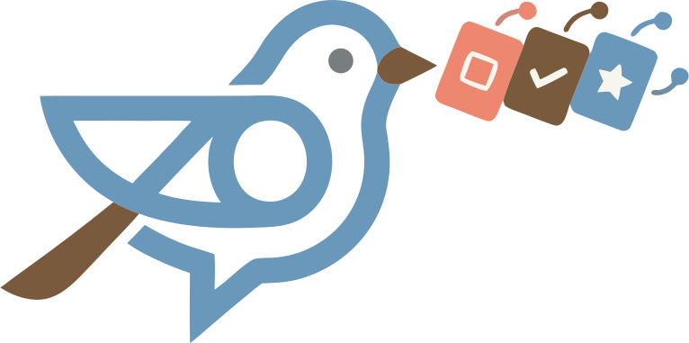
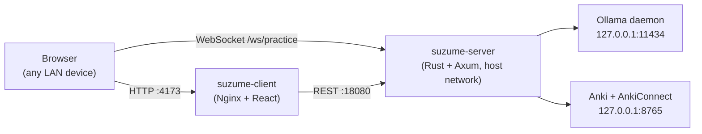

<p align="center">
  
</p>

<h1 align="center">Suzume</h1>

<p align="center">
  <em>A self-hosted language practice companion for your Anki decks, powered by a local LLM.</em>
</p>

---

## What is Suzume?

Suzume turns the vocabulary you already study in Anki into live, conversational practice. It pairs each card with a local [Ollama](https://ollama.com/) model and gives you a chat-style coach that quizzes you, translates with you, or asks you to build sentences with the words you're learning.

Everything runs on your own machine or NAS. There are no accounts, no API keys, and no calls to the public internet — Suzume only talks to Ollama and AnkiConnect on your host.

It's designed to be set up once on a home server and opened from any device on your LAN: laptop, tablet, or phone.

## Why is it called Suzume?

*Suzume* (雀) is the Japanese word for sparrow. Researchers studying Japanese great tits (a close relative, *Parus minor*) have shown that these little birds aren't just chirping — they actually use a form of [compositional syntax](https://www.youtube.com/watch?v=jmys2abx4co): individual calls carry distinct meanings ("scan for danger", "come here"), and the birds combine those calls into ordered sequences whose meaning depends on word order, much like human grammar.

A tiny bird quietly doing real language felt like the right mascot for a tool that helps you do the same — one small sentence at a time.

## Features

- **Three practice modes**
  - **Chat** — free-form conversation that nudges you toward today's vocabulary.
  - **Translate** — go from your native language to your target language, or the other way around.
  - **Construct** — build sentences around a given word.
- **Proficiency levels A1 → C2**, so prompts match where you actually are.
- **Scope** to cards you **learned today**, **reviewed today**, or to **everything you've ever studied** in the deck.
- **Live, streaming feedback** over WebSocket — corrections appear as you type.
- **Pluggable model and target language** picked from the in-app settings dialog (any model you've pulled with `ollama pull` works).
- **LAN-only by default** — Suzume binds to your host and uses CORS to gate access.

## How it fits together

Suzume is two containers plus two host-side services. The server uses Docker host networking so it can reach the Ollama and AnkiConnect daemons running directly on the host.



## Prerequisites

You need three things on the host machine before starting Suzume:

1. **Docker** and **Docker Compose**.
2. **Anki desktop** running with the [AnkiConnect](https://ankiweb.net/shared/info/2055492159) add-on enabled (default endpoint `http://127.0.0.1:8765`).
3. **Ollama** installed and running, with at least one chat-capable model pulled:
   ```bash
   ollama serve
   ollama pull qwen3
   ```

## Quick start

From the project root:

```bash
cp .env.example .env
# edit .env — most importantly, add your LAN URL to SUZUME_ALLOWED_ORIGINS

docker compose up -d --build
```

Then open the client from any device on your network:

```
http://<your-host-ip>:4173
```

Pick a deck from the sidebar, choose a mode, level, and scope, and start practicing.

## Configuration

Suzume is configured entirely through environment variables. Copy `.env.example` to `.env` and adjust as needed — Compose loads `.env` automatically and the values override the defaults baked into [docker-compose.yml](docker-compose.yml). `.env` is gitignored, so personal settings stay out of the repo.

- `SUZUME_SERVER_BIND_IP` — interface the API binds to. Default `0.0.0.0`.
- `SUZUME_SERVER_PORT` — API port. Default `18080`.
- `SUZUME_CLIENT_BIND_IP` — interface the client is exposed on. Default `0.0.0.0`.
- `SUZUME_CLIENT_PORT` — client port. Default `4173`.
- `OLLAMA_BASE_URL` — where the server reaches Ollama. Default `http://127.0.0.1:11434`.
- `ANKI_CONNECT_URL` — where the server reaches AnkiConnect. Default `http://127.0.0.1:8765`.
- `SUZUME_ALLOWED_ORIGINS` — comma-separated list of origins allowed to call the API. Default `http://localhost:4173,http://127.0.0.1:4173`.
- `RUST_LOG` — log filter for the server. Default `info,tower_http=info`.

### Letting LAN devices connect

Browsers send the `Origin` header based on the URL in the address bar — not the visitor's IP. So if everyone on your network opens `http://<your-host-ip>:4173`, you only need that one URL in `SUZUME_ALLOWED_ORIGINS`, regardless of how many devices connect.

Common patterns:

- **Single host (recommended):** `SUZUME_ALLOWED_ORIGINS=http://localhost:4173,http://127.0.0.1:4173,http://192.168.1.50:4173`
- **Multiple hostnames** (LAN IP + mDNS + custom domain): comma-separate them, e.g. `http://192.168.1.50:4173,http://nas.local:4173,https://suzume.example.com`
- **Trusted network, don't want to manage origins:** `SUZUME_ALLOWED_ORIGINS=*`. The API only exposes `GET` and uses no credentials, so this is safe on a private LAN — but don't do it if you're exposing the API to the internet.

## Day-to-day operations

```bash
docker compose up -d --build      # update + restart after pulling new code
docker compose down               # stop the stack
docker compose logs -f suzume-server
docker compose logs -f suzume-client
```

## Troubleshooting

Run these from the host (or any LAN device, swapping `127.0.0.1` for the host IP):

```bash
curl http://127.0.0.1:11434/api/tags                                  # Ollama reachable?
curl -s -X POST http://127.0.0.1:8765 \
     -d '{"action":"version","version":6}'                            # AnkiConnect reachable?
curl http://<host-ip>:18080/health                                    # API alive?
curl http://<host-ip>:18080/status                                    # dependency status
```

`/status` returns `ollama_connected` and `anki_connected` so you can see at a glance which side is unhappy.

If a device gets stuck on **"Checking system status…"** it's almost always one of:

- the device's origin is missing from `SUZUME_ALLOWED_ORIGINS` (browser dev tools will show a CORS error),
- the host firewall is blocking ports `4173` / `18080`,
- the Wi-Fi router has AP/client isolation enabled and devices can't reach the host.

## Tech stack

- **Backend:** Rust + [Axum](https://github.com/tokio-rs/axum) with WebSocket support, [ollama-rs](https://crates.io/crates/ollama-rs), [anki_bridge](https://crates.io/crates/anki_bridge), and `tower-http` for tracing/CORS.
- **Frontend:** React 19, [Radix Themes](https://www.radix-ui.com/themes), TanStack Query, React Router, built with Vite and served by Nginx.
- **Inference:** any chat-capable model served by your local Ollama daemon.
- **Vocabulary source:** Anki via the AnkiConnect add-on.

## Project layout

```
.
├── suzume-server/      # Rust + Axum API and WebSocket practice sessions
├── suzume-client/      # React + Radix client (logo lives in src/public/logo.svg)
├── docker-compose.yml  # the two-service stack
└── .env.example        # copy to .env and edit
```
